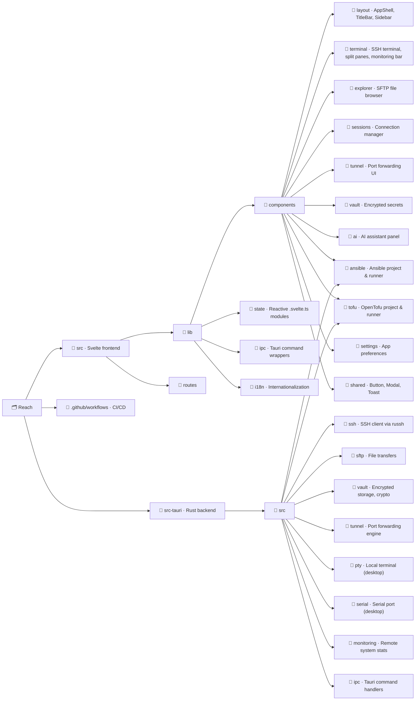

<p align="center">
  
</p>

<h1 align="center">Reach</h1>

<p align="center">
  A modern, cross-platform SSH client and remote management tool.<br>
  Built for engineers who got tired of PuTTY and wanted something that just works.
</p>

<p align="center">
  
  
  
</p>

<p align="center">
  <a href="https://alexandrosnt.github.io/Reach/"><strong>Documentation</strong></a> · <a href="https://github.com/alexandrosnt/Reach/releases">Download</a> · <a href="https://github.com/alexandrosnt/Reach/issues">Report a Bug</a>
</p>

> **About this fork.** This is a fork of [alexandrosnt/Reach](https://github.com/alexandrosnt/Reach). Upstream is canonical for releases, issues, documentation and the current feature set. Issues are disabled here, so file bugs upstream.
>
> The fork is based on upstream v0.4.9 (upstream has since reached v0.7.6) and adds four changes on top of that snapshot:
>
> - **macOS terminal copy and paste.** The default Tauri menu bound Cmd+C and Cmd+V to its own Copy and Paste items and swallowed the keys before the terminal saw them. The fork builds a custom macOS menu whose Copy and Paste items have no accelerators and handles the keys in `Terminal.svelte`. It also vendors OpenSSL (`openssl-sys`) so the app builds without system OpenSSL headers. Upstream later fixed Cmd+V its own way in a newer release.
> - **Vault password.** Setting or changing the vault password never worked in this snapshot, because the encrypted key was discarded at identity creation (upstream issue #25). The fork keeps the encrypted key, adds `VaultManager::change_password`, and returns a clear error when no password is set. Two unit tests cover it.
> - **Marketplace registry URL.** The registry URL override is saved in the encrypted settings vault and reloaded on startup. The Marketplace panel has a gear icon to edit or reset it. The default registry is still upstream's. A seeded registry with three plugins lives in [reach-plugins-registry](https://github.com/thefiredev-cloud/reach-plugins-registry).
> - **Support link.** A link in Settings → General points to the MeshVault skills pack storefront, because GitHub Sponsors is not enabled on this account. The repository's `.github/FUNDING.yml` is upstream's own file, so the Sponsor button on this fork goes to upstream's maintainer.
>
> Installers and auto-updates come from upstream and do not include these changes. Build this fork from source to get them. `src-tauri/Cargo.toml` still carries the `LicenseRef-Reach-SAL` identifier from before upstream's v0.7.4 correction; the `LICENSE` file is MIT.

---

<p align="center">
  
</p>

---

## Why Reach?

Most SSH tools feel like they were designed in 2005, because they were. MobaXterm is Windows-only and bloated, PuTTY hasn't changed in decades, and Termius wants a subscription for basic features.

Reach is what happens when you build an SSH client from scratch with a native UI, proper encryption, and the kind of workflow you'd actually want to use every day. No Electron. No monthly fee. Just a fast, clean tool that runs everywhere.

## What's inside

### Core

- **SSH Terminal** · Full interactive shell with WebGL rendering. Tabs, split views, and resize that actually works.
- **SFTP File Explorer** · Browse remote filesystems, drag-and-drop transfers, inline editing. Feels like a local file manager.
- **Session Manager** · Save connections with folders and tags. Credentials are encrypted at rest, not stored in plaintext configs.
- **Jump Host (ProxyJump)** · Connect through bastion servers with multi-hop SSH tunneling. Import hosts directly from `~/.ssh/config`.

### Productivity

- **Port Tunneling** · Local, remote, and dynamic SOCKS forwarding. Set it up once, save it with the session.
- **Snippets** · Save the commands you keep retyping and complete them with Tab.
- **System Monitoring** · Live CPU, memory, and disk stats from connected hosts without installing agents.

### Infrastructure as Code

- **Ansible** · Manage playbooks, inventories, roles, and collections. Run playbooks and ad-hoc commands with streaming output. Encrypts/decrypts files with ansible-vault. On Windows, automatically runs through WSL.
- **OpenTofu** · Plan, apply, and destroy infrastructure. Browse state, manage providers and modules. Full workspace with file editor and streaming command output.

### Extras

- **Serial Console** · Talk to routers, switches, and embedded devices over COM/TTY.
- **AI Assistant** · Optional AI integration for command suggestions and troubleshooting (bring your own API key).
- **Encrypted Vault** · Store secrets, credentials, and SSH keys in an encrypted vault with cloud sync support.
- **Host Key Verification** · Trust on first use, with a warning when a known host presents a different key.
- **Lua Plugins** · Extend Reach with sandboxed Lua scripts. Access SSH, storage, and UI hooks through the host API.
- **Auto-Updates** · The app checks for updates on startup and periodically while running. No manual downloads.

## Tech

Reach is a [Tauri v2](https://v2.tauri.app) app with a Rust backend and Svelte 5 frontend. The entire SSH stack runs natively in Rust through [russh](https://github.com/warp-tech/russh), with no OpenSSH dependency. The UI is rendered in a system webview (not bundled Chromium), so the final binary is small and memory usage stays low.

| | |
|---|---|
| **Backend** | Rust, Tokio, russh |
| **Frontend** | Svelte 5, SvelteKit, TypeScript |
| **Styling** | Tailwind CSS v4 |
| **Terminal** | xterm.js with WebGL addon |
| **Crypto** | XChaCha20-Poly1305, Argon2id, X25519 |
| **Platforms** | Windows, macOS, Linux, Android |

## Getting started

Releases are published by the [upstream project](https://github.com/alexandrosnt/Reach/releases), not by this fork, and they do not contain the fork's changes. Installers there cover Windows (NSIS), macOS (.dmg), Linux (.deb, .AppImage, .rpm), and Android (.apk). To run the fork, build it from source.

## Building from source

You'll need [Rust](https://rustup.rs), [Node.js 22+](https://nodejs.org), and the [Tauri prerequisites](https://v2.tauri.app/start/prerequisites/) for your OS.

```bash
git clone https://github.com/thefiredev-cloud/Reach.git
cd Reach
npm install
npm run tauri dev
```

For a production build:

```bash
npm run tauri build
```

## Project structure



## Changelog

See [CHANGELOG.md](CHANGELOG.md) for the full release history.

## Contributors

Thanks to those who have contributed to Reach:

<table>
  <tr>
    <td align="center">
      <a href="https://github.com/ddwnbot">
        <br />
        <sub><b>ddwnbot</b></sub>
      </a><br />
      <sub>SSH host key verification (TOFU)</sub>
    </td>
    <td align="center">
      <a href="https://github.com/alien-ye">
        <br />
        <sub><b>alien-ye</b></sub>
      </a><br />
      <sub>Click-to-copy terminal selection</sub>
    </td>
  </tr>
</table>

## Contributing

Contributions are welcome upstream. Bug reports, feature ideas, and pull requests all help. If you're picking up a larger feature, open an issue first so we can talk about the approach.

## License
### Licensed under the MIT License.
This project is free software: you are allowed to use, modify, and redistribute it for personal, academic, or commercial purposes under the terms of the MIT license. See the [LICENSE](LICENSE) file for full details.
